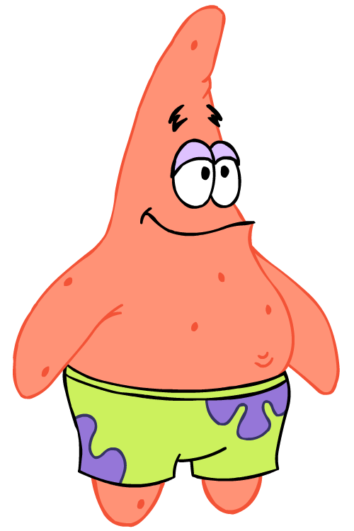
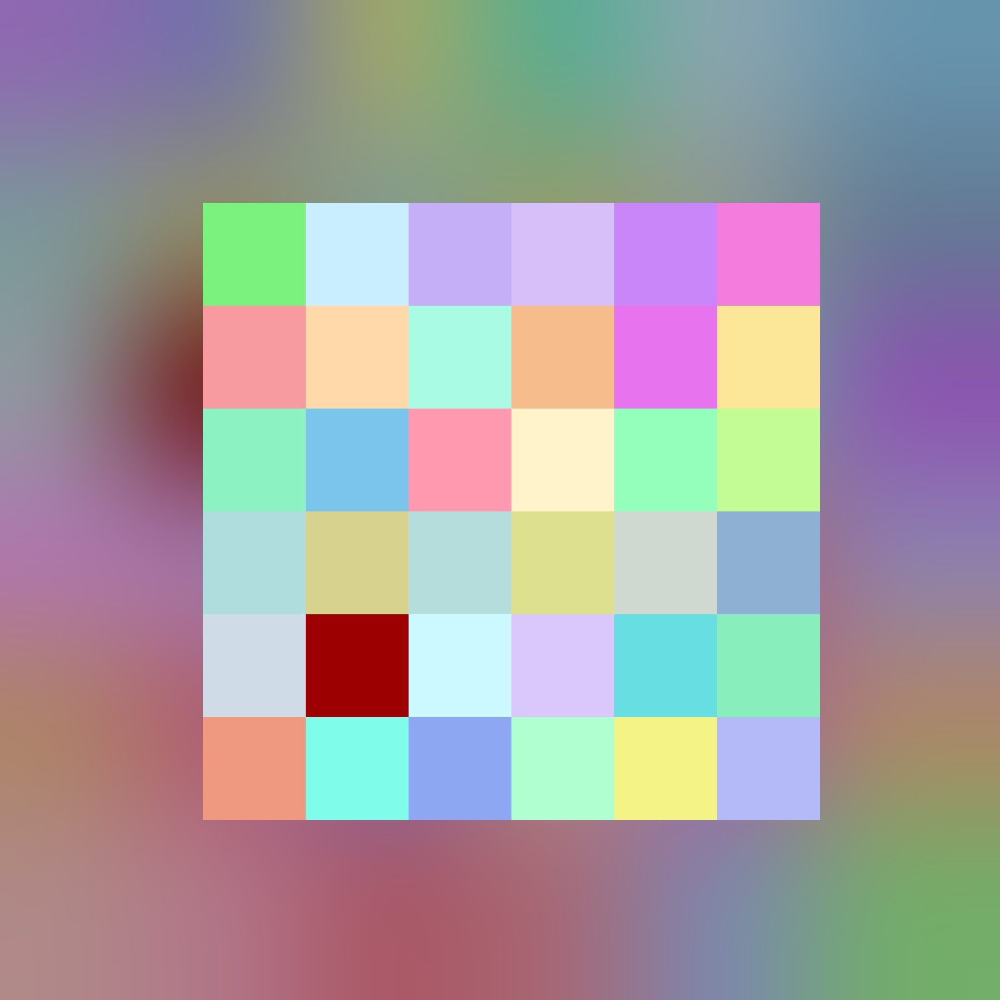

# Slash
---
## What is it:

Started as a way to encode text into images using encoding algo outlined here: [How-Encoding-works](#How-Encoding-works).

Now, it is mainly a library of wrapper classes around `JIMP` which lets you do some cool image manipulation.

## Classes:

`Image`, `EncodedImage`, `SquareImage`, `ImageFromFile`

#### Inheritance tree:


#### Examples:
**Generating an encoded Image:**
``` javascript
const str = fs.readFileSync("./sample.txt", "utf-8");
let encodedImage = new EncodedImage(str, false);
   encodedImage.resize(1080);
   encodedImage.writeKey(0,0)

encodedImage.writeToFile("./exports/encodedImage.png");
```


**Compositing two images on top of each other:**
```javascript
const str = fs.readFileSync("./sample.txt", "utf-8");

let encodedImage = new EncodedImage(str, false);
   encodedImage.resize(1080);

let pinkSquare = new SquareImage(1750, "#ff00bf");
let composite_positionX = 355;
let composite_positionY = 355;

pinkSquare.compositeUnder(encodedImage, composite_positionX, composite_positionY);

pinkSquare.writeToFile("./exports/compositeImage.png")
```


**Replacing colors:**
```javascript
let patrick = new ImageFromFile("./assets/patrick.png");

// NOTE: Leave second parameter empty to remove color.
patrick.replaceColor("#ff9176", "#6495ED");

patrick.writeToFile("./exports/bluePatrick.png");
```
| Before | After |
|--------|-------|
|        |       |


**Using many classes and default JIMP features:**
 
`(See examples in App.js)`

## How encoding works:
Each triplet of characters is stored as an RGB value for a pixel. The alpha for that pixel is randomly chosen to better hide the string.

The `key` contains information about the starting and ending position of the encoded string, and can be set to any position on the `EncodedImage` using `EncodedImage.setKey(positionX, positionY).`

## Dcoding:
Run `Node Decode.js` with an encoded image file.

---

#### Citations
* Some utils were forked from `replace-color` [Lisence link](https://github.com/turakvlad/replace-color/blob/master/LICENSE)

* Mainly built using `Jimp` [NPM link](https://www.npmjs.com/package/jimp)


